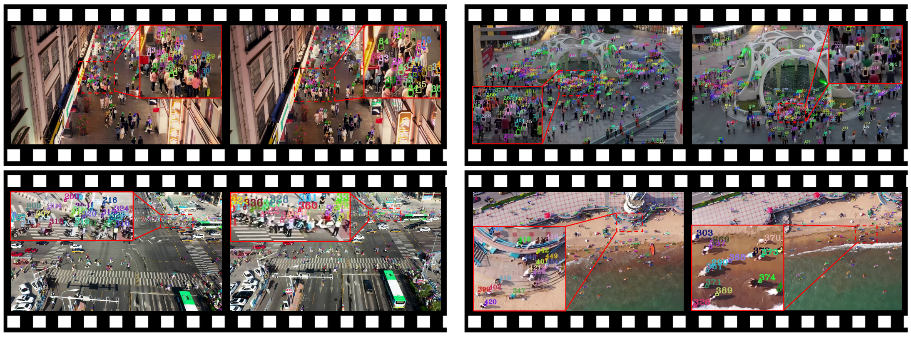
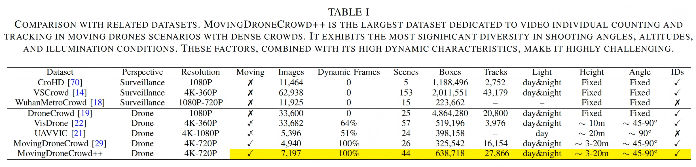
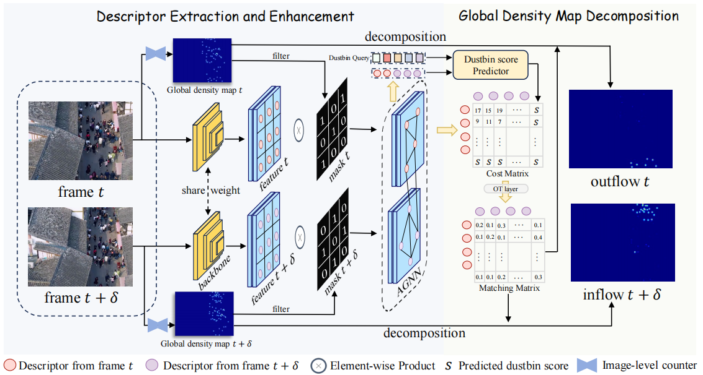
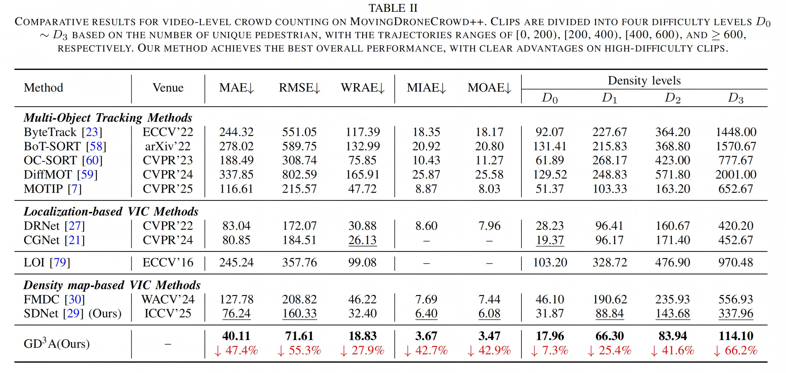
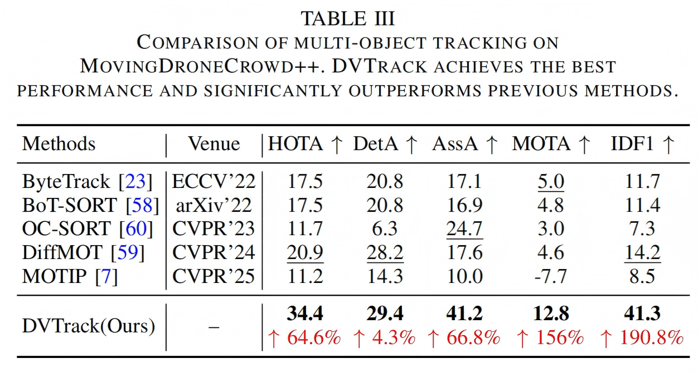

# Video Individual Counting and Tracking from Moving Drones (ICCV 2025 Highlight)

<p align="center">
  <a href="https://arxiv.org/abs/2601.12500"></a>
  <a href="https://arxiv.org/abs/2503.10701"></a>
  <a href="https://huggingface.co/datasets/fyw1999/MovingDroneCrowd"></a>
  <a href="https://huggingface.co/fyw1999/MovingDroneCrowd-Weights"></a>
  <a href="https://github.com/fyw1999/MovingDroneCrowd/releases"></a>
  <a href="https://github.com/fyw1999/MovingDroneCrowd"></a>
</p>

This is the official PyTorch project page for the **MovingDroneCrowd** series. The repository contains both the conference version and the extended version of our work on video individual counting and tracking from moving drones.

- **Conference version**: [Video Individual Counting for Moving Drones](https://arxiv.org/abs/2503.10701), an ICCV 2025 Highlight paper, introduced the **MovingDroneCrowd** dataset and **SDNet** for video individual counting.
- **Extended version**: [Video Individual Counting and Tracking from Moving Drones: A Benchmark and Methods](https://arxiv.org/abs/2601.12500) extends the benchmark to **MovingDroneCrowd++**, proposes the stronger and more interpretable VIC method **GD<sup>3</sup>A**, and further introduces the dense crowd tracking method **DVTrack**.

In short, **MovingDroneCrowd + SDNet** correspond to the conference paper, while **MovingDroneCrowd++ + GD<sup>3</sup>A + DVTrack** correspond to the extended paper. **MovingDroneCrowd++** is built by extending **MovingDroneCrowd**. This repository provides the extended MovingDroneCrowd++ dataset protocol and split files, while also preserving the split files of the conference-version MovingDroneCrowd for reproducibility.

The ICCV 2025 version of the code has been released separately. If you want to use the previous conference-version code, please refer to the [Releases](https://github.com/fyw1999/MovingDroneCrowd/releases) page.

## Catalog

- ✅ [MovingDroneCrowd / MovingDroneCrowd++](#movingdronecrowd--movingdronecrowd)
- ✅ [Training and Testing Code for SDNet, GD<sup>3</sup>A, and DVTrack](#training-and-testing-code-for-sdnet-gd3a-and-dvtrack)
- ✅ [Model Zoo](#model-zoo)

## MovingDroneCrowd / MovingDroneCrowd++

**MovingDroneCrowd** is the conference-version dataset for video individual counting from moving drones. **MovingDroneCrowd++** extends it to a larger, denser, and more diverse benchmark for both video individual counting and tracking. It contains moving-drone videos captured under diverse flight altitudes, camera angles, illumination conditions, and crowd densities.

The MovingDroneCrowd++ dataset is available on Hugging Face at [fyw1999/MovingDroneCrowd](https://huggingface.co/datasets/fyw1999/MovingDroneCrowd).

<p align="center">
  
</p>

The figure above shows examples from the MovingDroneCrowd series. Each pedestrian head is annotated with a bounding box and an identity ID across frames, enabling video individual counting, inflow/outflow analysis, and tracking evaluation.

<p align="center">
  
</p>

The table above compares MovingDroneCrowd++ with related crowd video datasets. MovingDroneCrowd++ provides dense, fully dynamic moving-drone videos with head boxes and identity annotations, supporting both video individual counting and tracking.

Expected dataset structure:

```text
MovingDroneCrowd++/
+-- frames/
|   +-- scene_1/
|       +-- 1/
|           +-- 1.jpg
|           +-- 2.jpg
|           +-- ...
+-- annotations/
|   +-- scene_1/
|       +-- 1.csv
+-- val.txt
+-- train.txt
+-- test.txt
+-- scene_labels.txt
+-- MDC_val.txt
+-- MDC_train.txt
+-- MDC_test.txt
```

`val.txt`, `train.txt`, and `test.txt` are the split files for the extended MovingDroneCrowd++ dataset. `MDC_val.txt`, `MDC_train.txt`, and `MDC_test.txt` preserve the split files of the conference-version MovingDroneCrowd dataset for reproducing the ICCV 2025 experiments.

Each annotation row follows the MOT-style format:

```text
frame_id, person_id, x, y, w, h, -1, -1, -1, -1
```

The first column is the frame index, the second column is the pedestrian identity, and the third to sixth columns are the head bounding box `(x, y, w, h)`. Image files are named from `1.jpg`, while frame indices start from `0`.

## Methods

### SDNet

SDNet is the conference-version method for video individual counting. It predicts shared density maps between adjacent frames through cross-frame attention, and then obtains the inflow and outflow density maps by subtracting the corresponding shared density map from the global density map of each frame.

<p align="center">
  
</p>

SDNet is suitable when identity annotations are unavailable. It does not require identity supervision for cross-frame association; in/out annotations are sufficient. This makes SDNet easier to apply to datasets without consistent trajectory IDs, such as UAVVIC from [streamer-AP/CGNet](https://github.com/streamer-AP/CGNet). However, SDNet has weaker interpretability because the shared/inflow/outflow density maps are learned implicitly. The cross-frame attention also brings high computational and memory costs, so training is relatively slow and requires more GPU memory.

### GD<sup>3</sup>A

GD<sup>3</sup>A is a video individual counting method that first establishes pixel-level correspondences between pedestrian descriptors across frames via optimal transport with an adaptive dustbin score. Then, a group-wise association is adopted to guide the decomposition of the global density map into shared, inflow, and outflow density maps.

By using a pretrained global density map to filter out background descriptors, GD<sup>3</sup>A substantially reduces computational complexity. Compared with existing strict one-to-one matching methods, its group-wise association is much more robust in dense and dynamic scenarios.

<p align="center">
  
</p>

GD<sup>3</sup>A requires identity supervision during training. However, it is more interpretable, trains faster, requires less GPU memory, and achieves better performance. Therefore, we recommend using GD<sup>3</sup>A as the preferred method when identity annotations are available.

### DVTrack

DVTrack is built on the group-wise descriptor association of GD<sup>3</sup>A. Without additional training, it converts pixel-level matching into instance-level associations via a voting mechanism, delivering strong tracking performance for dense pedestrians under highly dynamic drone motion.

### Method Choice

| Method | Task | Identity supervision | Main advantages | Main limitations |
| --- | --- | --- | --- | --- |
| SDNet | VIC | Not required | Works with in/out annotations; easier to use without IDs | Less interpretable; high computation; slower training |
| GD<sup>3</sup>A | VIC | Required | More interpretable; faster training; better accuracy when IDs are available | Requires ID annotations |
| DVTrack | Tracking | Uses trained GD<sup>3</sup>A | No extra training; strong dense-crowd tracking |  |

<a id="training-and-testing-code-for-sdnet-gd3a-and-dvtrack"></a>

## Training and Testing Code for SDNet, GD<sup>3</sup>A, and DVTrack

### Preparation

- Clone this repo in the directory.

- Install dependencies. We use Python 3.11 and PyTorch 2.4.1: [pytorch.org](http://pytorch.org).

```bash
conda create -n MovingDroneCrowd python=3.11 -y
conda activate MovingDroneCrowd

conda install pytorch==2.4.1 torchvision==0.19.1 torchaudio==2.4.1 pytorch-cuda=12.4 -c pytorch -c nvidia
cd ${MovingDroneCrowd}
pip install -r requirements.txt
```

- Datasets

  - **MovingDroneCrowd/MovingDroneCrowd++**: Download the dataset from [fyw1999/MovingDroneCrowd](https://huggingface.co/datasets/fyw1999/MovingDroneCrowd), unzip it if needed, and place it into your dataset folder. For example:

  ```bash
  huggingface-cli download fyw1999/MovingDroneCrowd --repo-type dataset --local-dir /path/to/MovingDroneCrowd++
  ```

  - **VSCrowd**: The original dataset is available at [HopLee6/VSCrowd-Dataset](https://github.com/HopLee6/VSCrowd-Dataset). Please refer to [DRNet](https://github.com/taohan10200/DRNet) for the dataset split and usage. Note that VSCrowd is also named `SENSE` in [DRNet](https://github.com/taohan10200/DRNet) and this codebase.

  - **UAVVIC**: Please refer to their code repository [CGNet](https://github.com/streamer-AP/CGNet).

  After preparing a dataset, set dataset-related parameters in the corresponding file under `cusdatasets/setting/`. For example, for MovingDroneCrowd/MovingDroneCrowd++, the commonly changed options are:

  ```python
  __C_MDC.DATA_PATH = '/path/to/MovingDroneCrowd++/'
  __C_MDC.TRAIN_BATCH_SIZE = 1
  ```

  Other dataset parameters, such as split file names and image size settings, can usually keep their default values.

  For GD<sup>3</sup>A, `TRAIN_BATCH_SIZE` can be set to `4` on a 48GB GPU. For SDNet, `TRAIN_BATCH_SIZE` should be set to `1` on a 48GB GPU because it requires more GPU memory.

### Training

Before using a specific method, first set the basic experiment parameters in `config.py`, including `MODEL`, `NAME`, `DATASET`, `encoder`, and `GPU_ID`. For MovingDroneCrowd++, keep `DATASET = 'MovingDroneCrowd'` in `config.py`, and set `DATA_PATH` in `cusdatasets/setting/MovingDroneCrowd.py` to the MovingDroneCrowd++ dataset path.

```python
__C.MODEL = "SDNet"  # "SDNet" or "GD3A"
__C.NAME = "experiment name"
__C.DATASET = "MovingDroneCrowd"
__C.encoder = "VGG16_FPN"
__C.GPU_ID = "0,1,2,3"
```

##### Train SDNet

Set the following parameters in `config.py` before training. We recommend setting `PRE_TRAIN_COUNTER` to the path of a global density-map estimation model pretrained on the corresponding target dataset to accelerate convergence. To maintain good performance, besides setting `PRE_TRAIN_COUNTER`, it is also recommended to keep the global batch size at least `4`.

The pretrained global density-map estimation models for SDNet are available from [fyw1999/MovingDroneCrowd-Weights](https://huggingface.co/fyw1999/MovingDroneCrowd-Weights):

| Dataset | Pretrained counter |
| --- | --- |
| MovingDroneCrowd | [SDNet_pre_trained_counter_MDC_VGG16_FPN_ep_200_downscale_16.pth](https://huggingface.co/fyw1999/MovingDroneCrowd-Weights/resolve/main/SDNet_pre_trained_counter_MDC_VGG16_FPN_ep_200_downscale_16.pth) |
| MovingDroneCrowd++ | [SDNet_pre_trained_counter_MDC++_VGG16_FPN_ep_150_downscale_16.pth](https://huggingface.co/fyw1999/MovingDroneCrowd-Weights/resolve/main/SDNet_pre_trained_counter_MDC%2B%2B_VGG16_FPN_ep_150_downscale_16.pth) |
| VSCrowd | [SDNet_pre_trained_counter_VSCrowd_VGG16_FPN_ep_100_downscale_16.pth](https://huggingface.co/fyw1999/MovingDroneCrowd-Weights/resolve/main/SDNet_pre_trained_counter_VSCrowd_VGG16_FPN_ep_100_downscale_16.pth) |

We recommend setting the following training parameters, while keeping the remaining parameters at their default values.

```python
__C.PRE_TRAIN_COUNTER = "/path/to/SDNet_pre_trained_counter_MDC++_VGG16_FPN_ep_150_downscale_16.pth"

__C.LR_Base = 1e-5
__C.WEIGHT_DECAY = 1e-6
__C.MAX_EPOCH = 120
__C.VAL_INTERVAL = 10
__C.START_VAL = 20
__C.PRINT_FREQ = 20
```

Run:

```bash
python train.py
```

For distributed training:

```bash
torchrun --master_port 29515 --nproc_per_node=4 train.py
```

##### Train GD<sup>3</sup>A

Set `global_counter` before training. Here, `global_counter` refers to a pretrained image-level density-map estimator. The current code supports `STEERER` from [taohan10200/STEERER](https://github.com/taohan10200/STEERER) and `customed`, a simple custom density-map estimator composed of VGG16, FPN, and a density regression head. Other image-level density-map estimators can also be plugged in, but their downsampling rate should be consistent with GD<sup>3</sup>A, which is currently `8`, and the output density map must have the correct scale, for example after applying the correct density factor.

After choosing `global_counter`, set `pre_trained_global_counter` to the path of the corresponding model pretrained on the target dataset. 

The pretrained global counters for GD<sup>3</sup>A are available from [fyw1999/MovingDroneCrowd-Weights](https://huggingface.co/fyw1999/MovingDroneCrowd-Weights):

| Dataset | Counter | Pretrained global counter |
| --- | --- | --- |
| MovingDroneCrowd++ | STEERER | [GD3A_pre_trained_global_counter_STEERER_MDC++_ep_201_mae_13.5_mse_19.1.pth](https://huggingface.co/fyw1999/MovingDroneCrowd-Weights/resolve/main/GD3A_pre_trained_global_counter_STEERER_MDC%2B%2B_ep_201_mae_13.5_mse_19.1.pth) |
| VSCrowd | customed | [GD3A_pre_trained_global_counter_VGG16_FPN_VSCrowd_kernel_size_25_epoch_50.pth](https://huggingface.co/fyw1999/MovingDroneCrowd-Weights/resolve/main/GD3A_pre_trained_global_counter_VGG16_FPN_VSCrowd_kernel_size_25_epoch_50.pth) |

We recommend setting the following training parameters, while keeping the remaining parameters at their default values.

```python
__C.global_counter = "STEERER"  # "STEERER" or "customed"
__C.pre_trained_global_counter = "/path/to/GD3A_pre_trained_global_counter_STEERER_MDC++_ep_201_mae_13.5_mse_19.1.pth"

__C.LR_Base = 5e-5
__C.LR_Thre = 1e-4
__C.WEIGHT_DECAY = 1e-5
__C.MAX_EPOCH = 20
__C.VAL_INTERVAL = 2
__C.START_VAL = 1
```

Run:

```bash
python train.py
```

For distributed training:

```bash
torchrun --master_port 29515 --nproc_per_node=4 train.py
```

### Test

#### Test SDNet / GD<sup>3</sup>A

`test.py` evaluates SDNet or GD<sup>3</sup>A on MovingDroneCrowd++. The main difference is the value of `MODEL`. For both methods, set `model_path` to the trained SDNet or GD<sup>3</sup>A checkpoint. For GD<sup>3</sup>A, additionally set `counter` to `STEERER` or `customed`, and set `pre_trained_counter_path` to the corresponding pretrained global counter. For SDNet, `counter` and `pre_trained_counter_path` are not needed. Other options such as `output_dir`, `test_name`, `test_visual`, and `GPU_ID` can be changed according to your needs.

Example for SDNet:

```bash
python test.py \
  --MODEL SDNet \
  --DATASET MovingDroneCrowd \
  --model_path /path/to/sdnet_model.pth \
  --output_dir test_results \
  --test_name sdnet_test \
  --GPU_ID 0
```

Example for GD<sup>3</sup>A:

```bash
python test.py \
  --MODEL GD3A \
  --DATASET MovingDroneCrowd \
  --model_path /path/to/gd3a_model.pth \
  --counter STEERER \
  --pre_trained_counter_path /path/to/pretrained_global_counter.pth \
  --output_dir test_results \
  --test_name gd3a_test \
  --GPU_ID 0
```

To save visualizations, set `--test_visual True`. If you need full inflow/outflow evaluation (MIAE and MOAE) on every adjacent pair, set `skip_flag=False` in `test.py` before running.
#### Test DVTrack

For DVTrack, `MODEL` must be `GD3A`. The model and counter parameters are the same as in the GD<sup>3</sup>A test above: set `model_path` to the trained GD<sup>3</sup>A checkpoint, set `counter` to `STEERER` or `customed`, and set `pre_trained_counter_path` to the corresponding pretrained global counter.

```bash
python DVTracker.py \
  --MODEL GD3A \
  --DATASET MovingDroneCrowd \
  --model_path /path/to/gd3a_model.pth \
  --counter STEERER \
  --pre_trained_counter_path /path/to/pretrained_global_counter.pth \
  --test_name tracker_evaluation \
  --GPU_ID 0
```

Evaluate the tracking results with TrackEval. Set `dataset_root` to the MovingDroneCrowd++ dataset path, and set `pred_root` to the prediction result path saved by `DVTracker.py`.

```bash
python DVTack_evaluation.py \
  --dataset_root /path/to/MovingDroneCrowd++ \
  --pred_root test_results/MovingDroneCrowd/<tracker_run_name> \
```

## Results

Video individual counting comparison on MovingDroneCrowd++:

<p align="center">
  
</p>

Tracking comparison on MovingDroneCrowd++:

<p align="center">
  
</p>

## Model Zoo

Download links will be updated for the released pretrained models.

| Model | Backbone | Dataset | MAE | RMSE | Download |
| --- | --- | --- | ---: | ---: | --- |
| SDNet | VGG | MovingDroneCrowd | 44.33 | 74.53 | [download](https://huggingface.co/fyw1999/MovingDroneCrowd-Weights/resolve/main/SDNet_MDC_best_model_VGG16_FPN.pth) |
| SDNet | VGG | MovingDroneCrowd++ | 76.24 | 160.33 | [download](https://huggingface.co/fyw1999/MovingDroneCrowd-Weights/resolve/main/SDNet_MDC%2B%2B_best_model_VGG16_FPN.pth) |
| GD<sup>3</sup>A | VGG | MovingDroneCrowd++ | 45.23 | 73.27 | [download](https://huggingface.co/fyw1999/MovingDroneCrowd-Weights/resolve/main/GD3A_MDC%2B%2B_best_model_VGG16.pth) |
| GD<sup>3</sup>A | ResNet | MovingDroneCrowd++ | 40.11 | 71.61 | [download](https://huggingface.co/fyw1999/MovingDroneCrowd-Weights/resolve/main/GD3A_MDC%2B%2B_best_model_ResNet50.pth) |

### ⚠️ Note on Reproduction

The provided SDNet weight on MovingDroneCrowd, namely the first row in the Model Zoo, was retrained for this repository. Due to the expiration of access to the original training server, the original weights are unavailable. While minor discrepancies exist compared to the published metrics in the paper, the model consistently maintains SOTA performance. To reproduce the results on the MovingDroneCrowd dataset, we recommend using the provided pretrained density-map estimation model. The total batch size, i.e., GPUs times batch size per GPU, should be set to `4`, with training for `120` epochs.

## Citation

If this project helps your research, please cite the extended paper and the conference version.

```bibtex
@article{MDC++_GD3A,
  title={Video Individual Counting and Tracking from Moving Drones: A Benchmark and Methods},
  author={Fan, Yaowu and Wan, Jia and Han, Tao and Ma, Andy J. and Ouyang, Wanli and Chan, Antoni B.},
  journal={arXiv preprint arXiv:2601.12500},
  year={2026}
}

@inproceedings{MDC_SDNet,
  title={Video Individual Counting for Moving Drones},
  author={Fan, Yaowu and Wan, Jia and Han, Tao and Chan, Antoni B. and Ma, Andy J.},
  booktitle={Proceedings of the IEEE/CVF International Conference on Computer Vision (ICCV)},
  month={October},
  year={2025},
  pages={12284--12293}
}
```

## Acknowledgements
The implementation refers to or adapts code from [STEERER](https://github.com/taohan10200/STEERER), [DRNet](https://github.com/taohan10200/DRNet), and [SuperGlue](https://github.com/magicleap/SuperGluePretrainedNetwork). Please consider citing the corresponding works if you use those components.

## 📫 Contact

If you have any questions, please feel free to leave a message in the [Issues](https://github.com/fyw1999/MovingDroneCrowd/issues) section. If I do not respond in time, please contact me via email at [fanyw5@mail2.sysu.edu.cn](mailto:fanyw5@mail2.sysu.edu.cn) or [fywyukee@gmail.com](mailto:fywyukee@gmail.com), as I may not receive timely email notifications from GitHub issues.
